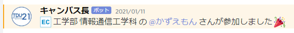

# 参加方法

本キャンパスに参加いただくには **Discord のアカウントが必要**です。  

::: tip Discordのアカウントをお持ちでない場合
Discordのアカウントをお持ちでない場合は、[こちら](https://support.discord.com/hc/ja/articles/360033931551-%E3%81%AF%E3%81%98%E3%82%81%E3%81%AB)を参考にアカウントを作成してください。
:::

以降の手順は、既にアカウントを作成した状態で進めてください。

## 1. まずはルールを読んでください

トラブルの発生などを防ぐため、最低限のルールを設定しています。  
ルールは [こちら](/rule) からチェックしてください。  
**サーバー参加時点で、ルールを読み同意したものとみなします。**

## 2. サーバーに参加します

下記画像をクリック/タップして Discord のサーバーに参加してください。

## 3. 学科を設定します

左のメニューから #学科設定 チャンネルに移動します。

投稿されているメッセージの下に各学科のアイコンと数字が表示されている場所がありますので、**自分の学科のアイコンをクリック/タップ**してください。

::: warning 間違って選んでしまったら
システムの仕様上、**一度選択した後に取り消しすることはできません**。
モデレーターにご連絡いただければ手動で対応いたします。
:::

正常に設定出来れば、**自分の名前の色が学部の色に変わり、「メンバー」と学科ロールが付与**されます。

合わせて `#101_自己紹介` と `#2xx_[学科名]` チャンネルからメンションが送信されますので、まずは2つで自己紹介しましょう！

  

## 4. れっつ交流！

以上でキャンパスへの参加は完了です :tada:  
交流を楽しみましょう！

::: tip Discord の使い方がわからないときは
Discordキャンパス1号館`#106_Discord の使い方`にて質問してみましょう！  
Discord公式の[初心者ガイド](https://support.discord.com/hc/ja/articles/360045138571-Discord-%E5%88%9D%E5%BF%83%E8%80%85%E3%82%AC%E3%82%A4%E3%83%89)もぜひチェックしてみてください:thumbsup:
:::
