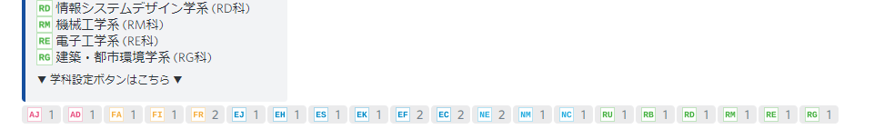
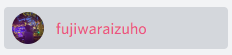

# 参加方法

## 1. ルールを読んでください

トラブルの発生などを防ぐため、最低限のルールを設定しています。  
ルールは [こちら](/rule) からチェックしてください。  
**サーバー参加時点で、ルールを読み同意したものとみなします。**

## 2. サーバーに参加します

Discordのアカウントをお持ちでない方は事前に作成してください。  
作成後、下記画像をクリック/タップしてDiscordのサーバーに参加してください。

## 3. 学科を設定します

左のメニューから #学科設定 チャンネルに移動します。

  
投稿されているメッセージの下に各学科のアイコンと数字が表示されている場所がありますので、**自分の学科のアイコンをクリック/タップ**してください。

::: warning 間違って選んでしまったら
システムの仕様上、**一度選択した後に取り消しすることはできません**。
モデレーターにご連絡いただければ手動で対応いたします。
:::

正常に設定出来れば、_自分の名前の色が学部の色に変わり、「メンバー」と学科ロールが付与_されます。

## 4. れっつ交流！

以上で参加完了です！  
交流を楽しみましょう！
